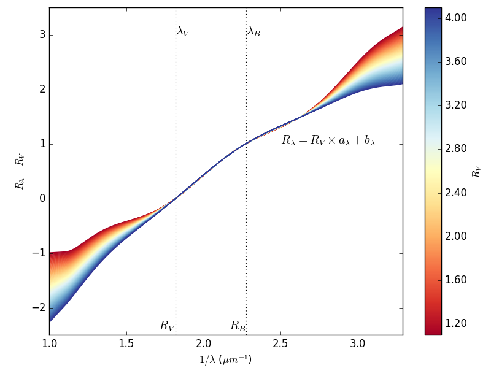
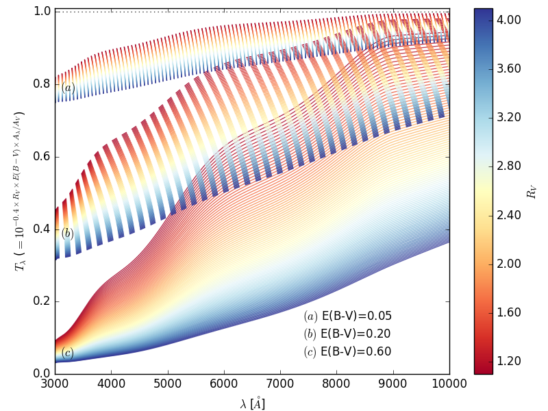

Extinction laws
---------------

Avalaible extinction laws from extinction.py
       

- Goobar law: Set the values for the MW dust:
  
  - a = 0.90
  - p = -1.50
  - Corresponding: Rv =2.79
    
- CCM law Rv = 3.1 and Rv = 2.8
- Fitzpatrick law: for Rv = 3.1. Use the standard set of parameters for MW:
  
  - c1=-0.07
  - c2=0.70
  - c3=3.23
  - c4=0.41
  - x0=4.60
  - gamma=0.99

- O'Donnel 94 law: for Rv = 3.1

.. image:: extinction_laws.png
    
CCM89 extinction law
--------------------

- Top panel: Cardelli extinction law parammeters a and b (top pannel).
- Bottom panel:

  - CCM extinction law as A(lbd)/Av = a+b/Rv for Rv = 3.10
  - Interstellar medium transmission for Rv = 3.10 and E(B-V) = 0.30.

.. image:: ccm_law.png
        
A(lbd)/Av variability
---------------------

Cardelli extinction law for several values of Rv. This figure express
the extinction law variability as a function af Rv.

.. image:: ccm_law_variability.png

R(lbd)-Rv variability
---------------------

CCM law expressed as R(lbd)-Rv for several values of Rv.

Transmission variability
------------------------

Dust cloud transmission variablitiy as a function of Rv and E(B-V). A
degeneracy between the Rv and E(B-V) variabilities can be seen in the
IR.

